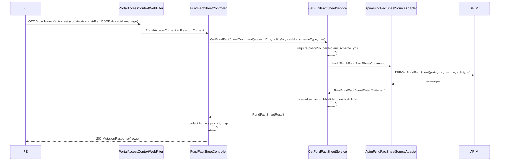
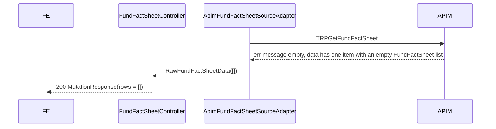
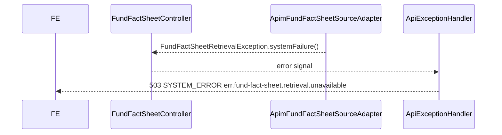
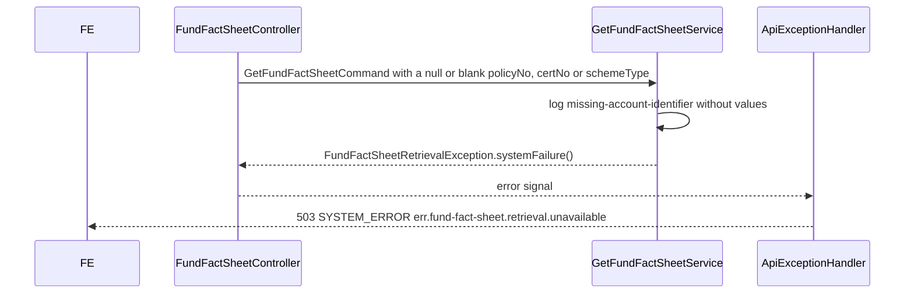

# Fund Fact Sheet Sequence Diagrams

## Success

```mermaid
sequenceDiagram
    participant FE
    participant Filter as PortalAccessContextWebFilter
    participant Ctl as FundFactSheetController
    participant UC as GetFundFactSheetService
    participant Ad as ApimFundFactSheetSourceAdapter
    participant APIM
    FE->>Filter: GET /api/v1/fund-fact-sheet (cookie, Account-Ref, CSRF, Accept-Language)
    Filter->>Ctl: PortalAccessContext in Reactor Context
    Ctl->>UC: GetFundFactSheetCommand(accountEnv, policyNo, certNo, schemeType, role)
    UC->>UC: require policyNo, certNo and schemeType
    UC->>Ad: fetch(FetchFundFactSheetCommand)
    Ad->>APIM: TRPGetFundFactSheet(policy-no, cert-no, sch-type)
    APIM-->>Ad: envelope
    Ad-->>UC: RawFundFactSheetData (flattened)
    UC->>UC: normalize rows, UrlValidator on both links
    UC-->>Ctl: FundFactSheetResult
    Ctl->>Ctl: select language, sort, map
    Ctl-->>FE: 200 MutationResponse(rows)
```

## No funds

```mermaid
sequenceDiagram
    participant FE
    participant Ctl as FundFactSheetController
    participant Ad as ApimFundFactSheetSourceAdapter
    participant APIM
    Ad->>APIM: TRPGetFundFactSheet
    APIM-->>Ad: err-message empty, data has one item with an empty FundFactSheet list
    Ad-->>Ctl: RawFundFactSheetData([])
    Ctl-->>FE: 200 MutationResponse(rows = [])
```

## Downstream failure

```mermaid
sequenceDiagram
    participant FE
    participant Ctl as FundFactSheetController
    participant Ad as ApimFundFactSheetSourceAdapter
    participant H as ApiExceptionHandler
    Ad-->>Ctl: FundFactSheetRetrievalException.systemFailure()
    Ctl-->>H: error signal
    H-->>FE: 503 SYSTEM_ERROR err.fund-fact-sheet.retrieval.unavailable
```

## Absent account identifier

```mermaid
sequenceDiagram
    participant FE
    participant Ctl as FundFactSheetController
    participant UC as GetFundFactSheetService
    participant H as ApiExceptionHandler
    Ctl->>UC: GetFundFactSheetCommand with a null or blank policyNo, certNo or schemeType
    UC->>UC: log missing-account-identifier without values
    UC-->>Ctl: FundFactSheetRetrievalException.systemFailure()
    Ctl-->>H: error signal
    H-->>FE: 503 SYSTEM_ERROR err.fund-fact-sheet.retrieval.unavailable
```
