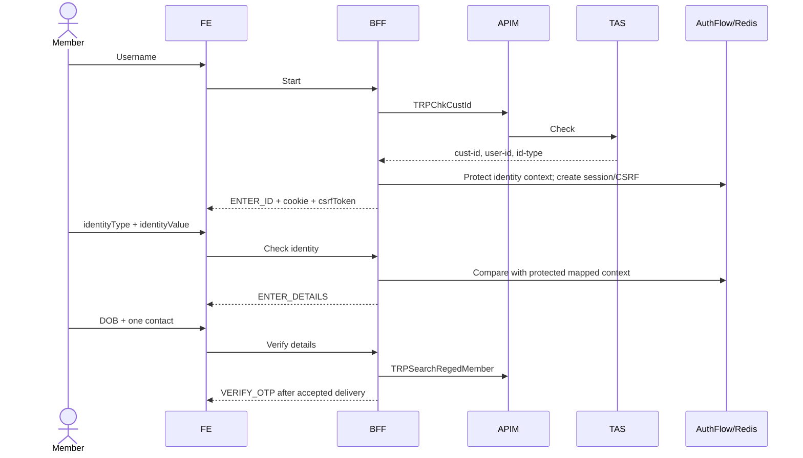
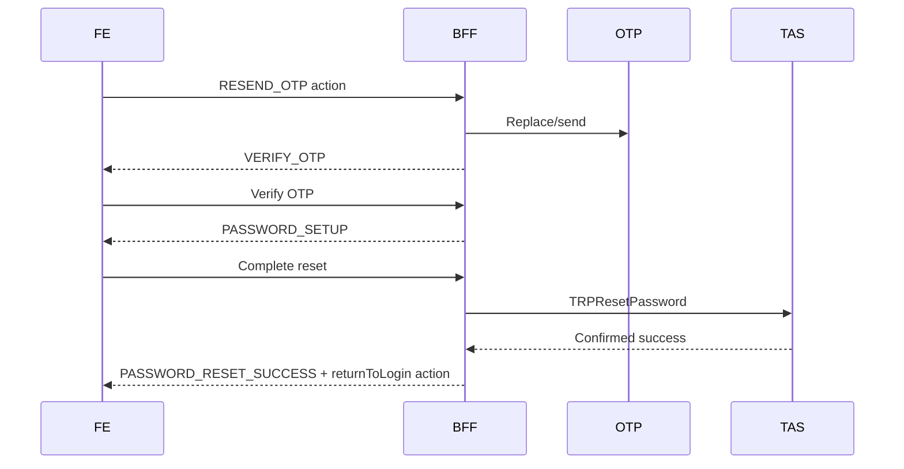

# Forgot Password Sequence Diagrams

**Feature:** 0061 - Forgot Password
**Baseline:** 2026-07-30
**Gate:** 3

```mermaid
sequenceDiagram
  actor M as Member
  participant FE
  participant BFF
  participant APIM
  participant TAS
  participant S as AuthFlow/Redis
  M->>FE: Username
  FE->>BFF: Start
  BFF->>APIM: TRPChkCustId
  APIM->>TAS: Check
  TAS-->>BFF: cust-id, user-id, id-type
  BFF->>S: Protect identity context#59; create session/CSRF
  BFF-->>FE: ENTER_ID + cookie + csrfToken
  M->>FE: identityType + identityValue
  FE->>BFF: Check identity
  BFF->>S: Compare with protected mapped context
  BFF-->>FE: ENTER_DETAILS
  M->>FE: DOB + one contact
  FE->>BFF: Verify details
  BFF->>APIM: TRPSearchRegedMember
  BFF-->>FE: VERIFY_OTP after accepted delivery
```

```mermaid
sequenceDiagram
  participant FE
  participant BFF
  participant OTP
  participant TAS
  FE->>BFF: RESEND_OTP action
  BFF->>OTP: Replace/send
  BFF-->>FE: VERIFY_OTP
  FE->>BFF: Verify OTP
  BFF-->>FE: PASSWORD_SETUP
  FE->>BFF: Complete reset
  BFF->>TAS: TRPResetPassword
  TAS-->>BFF: Confirmed success
  BFF-->>FE: PASSWORD_RESET_SUCCESS + returnToLogin action
```
