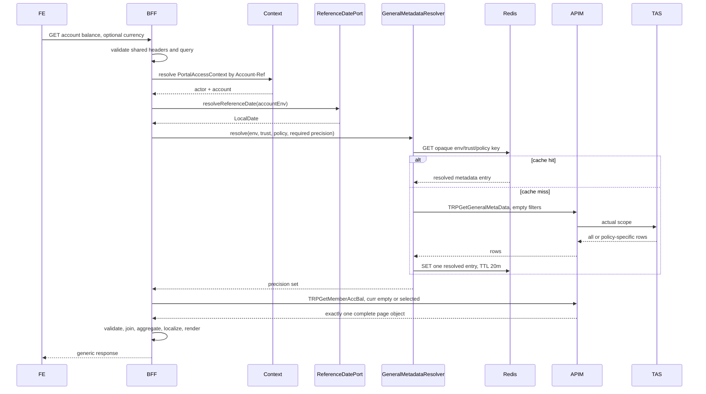

# Account Balance Sequence Diagrams

**Feature:** 6.14 Account Balance  
**Baseline:** 27/08/2026  
**Status:** Consolidated design baseline, pending repository investigation  

## Page load

```mermaid
sequenceDiagram
  participant FE
  participant BFF
  participant Context
  participant Ref as ReferenceDatePort
  participant Meta as GeneralMetadataResolver
  participant Redis
  participant APIM
  participant TAS
  FE->>BFF: GET account balance, optional currency
  BFF->>BFF: validate shared headers and query
  BFF->>Context: resolve PortalAccessContext by Account-Ref
  Context-->>BFF: actor + account
  BFF->>Ref: resolveReferenceDate(accountEnv)
  Ref-->>BFF: LocalDate
  BFF->>Meta: resolve(env, trust, policy, required precision)
  Meta->>Redis: GET opaque env/trust/policy key
  alt cache hit
    Redis-->>Meta: resolved metadata entry
  else cache miss
    Meta->>APIM: TRPGetGeneralMetaData, empty filters
    APIM->>TAS: actual scope
    TAS-->>APIM: all or policy-specific rows
    APIM-->>Meta: rows
    Meta->>Redis: SET one resolved entry, TTL 20m
  end
  Meta-->>BFF: precision set
  BFF->>APIM: TRPGetMemberAccBal, curr empty or selected
  APIM-->>BFF: exactly one complete page object
  BFF->>BFF: validate, join, aggregate, localize, render
  BFF-->>FE: generic response
```
