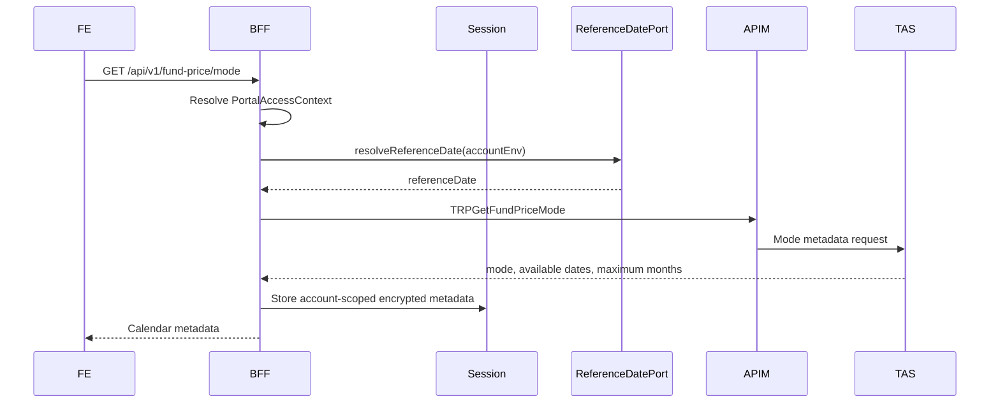
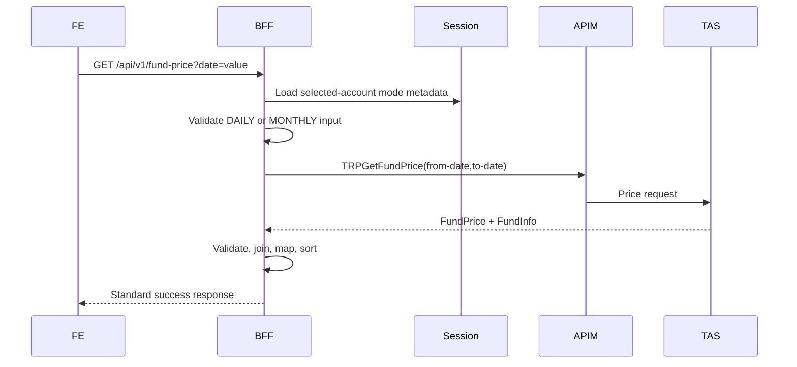
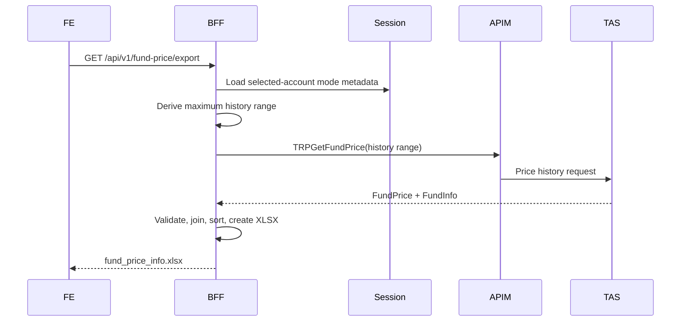

# Fund Price Sequence Diagrams

## Page load

```mermaid
sequenceDiagram
    participant FE
    participant BFF
    participant Session
    participant Ref as ReferenceDatePort
    participant APIM
    participant TAS
    FE->>BFF: GET /api/v1/fund-price/mode
    BFF->>BFF: Resolve PortalAccessContext
    BFF->>Ref: resolveReferenceDate(accountEnv)
    Ref-->>BFF: referenceDate
    BFF->>APIM: TRPGetFundPriceMode
    APIM->>TAS: Mode metadata request
    TAS-->>BFF: mode, available dates, maximum months
    BFF->>Session: Store account-scoped encrypted metadata
    BFF-->>FE: Calendar metadata
```

## Price query

```mermaid
sequenceDiagram
    participant FE
    participant BFF
    participant Session
    participant APIM
    participant TAS
    FE->>BFF: GET /api/v1/fund-price?date=value
    BFF->>Session: Load selected-account mode metadata
    BFF->>BFF: Validate DAILY or MONTHLY input
    BFF->>APIM: TRPGetFundPrice(from-date,to-date)
    APIM->>TAS: Price request
    TAS-->>BFF: FundPrice + FundInfo
    BFF->>BFF: Validate, join, map, sort
    BFF-->>FE: Standard success response
```

## Export

```mermaid
sequenceDiagram
    participant FE
    participant BFF
    participant Session
    participant APIM
    participant TAS
    FE->>BFF: GET /api/v1/fund-price/export
    BFF->>Session: Load selected-account mode metadata
    BFF->>BFF: Derive maximum history range
    BFF->>APIM: TRPGetFundPrice(history range)
    APIM->>TAS: Price history request
    TAS-->>BFF: FundPrice + FundInfo
    BFF->>BFF: Validate, join, sort, create XLSX
    BFF-->>FE: fund_price_info.xlsx
```
